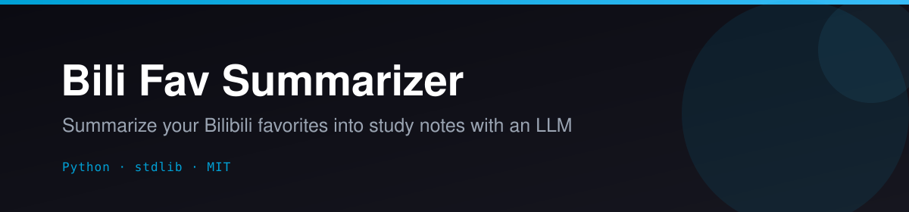
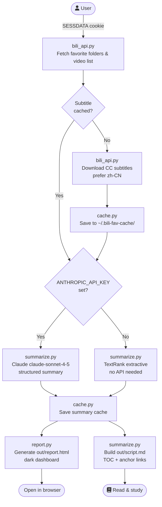

<p align="center"></p>

<p align="center">
  <a href="LICENSE"></a>
  
  
  
  
</p>

# 📺 Bili Fav Summarizer

**Turn your Bilibili favorites into structured study notes — no pip installs, no fuss.**

Point it at any favorite folder, and it fetches subtitles, summarizes every video (via Claude or a fully offline TextRank fallback), and emits a combined `script.md` and a beautiful self-contained `report.html` — all using Python stdlib only.

---

## ✨ Features

- **Zero dependencies** — pure Python stdlib (`urllib`, `json`, `argparse`, `re`, `math`); just `python3 main.py`
- **Two summarization modes** — Claude `claude-sonnet-4-5` for rich LLM notes, or a built-in TextRank extractive summarizer that works completely offline
- **CJK-aware** — sentence splitting on `。！？；`, Chinese stopword filtering, and reading-time estimation at 350 chars/min
- **Smart caching** — subtitles and summaries are cached in `~/.bili-fav-cache/`; re-runs are instant; `--refresh` busts the cache
- **Offline demo** — `python3 main.py --demo` runs the full pipeline on a bundled sample with no credentials
- **Standalone HTML dashboard** — dark theme, sidebar TOC, live search/filter, video cards with tags and reading time, works offline
- **Combined study script** — `out/script.md` with table of contents and anchor links for every video
- **Resilient** — up to 3 retries with exponential backoff (2/5/10 s), 0.6 s polite delay between requests
- **Folder selection** — pick by numeric ID, case-insensitive name substring, or process all folders at once

---

## 🎬 How it works



---

## 🚀 Quickstart

### 1. Clone & verify (no credentials needed)

```bash
git clone https://github.com/Alchemist-X/bili-fav-summarizer.git
cd bili-fav-summarizer

# Full offline demo — runs on a bundled sample subtitle, writes out/ files
python3 main.py --demo
# Then open out/report.html in your browser
```

### 2. Set up credentials

```bash
cp .env.example .env
# Edit .env — add your BILI_SESSDATA (required) and optionally ANTHROPIC_API_KEY
source .env
```

> **How to get `SESSDATA`:** Log into [bilibili.com](https://www.bilibili.com), open DevTools → **Application** (Chrome) / **Storage** (Firefox) → Cookies → `api.bilibili.com`, copy the `SESSDATA` value. It expires periodically — re-copy if you get 401/403 errors.

### 3. Run

```bash
# Summarize a specific folder (find the ID in the URL: /medialist/detail/ml12345678)
python3 main.py --folder 12345678

# Or pick by name (case-insensitive substring match)
python3 main.py --folder-name "英语学习"

# Summarize every favorite folder
python3 main.py --all

# Useful flags
python3 main.py --all --limit 10      # first 10 videos per folder (great for testing)
python3 main.py --folder 12345678 --refresh  # bypass cache, re-download everything
```

### Output

```
out/
  script.md                        # Combined study script with TOC
  report.html                      # Standalone HTML dashboard (open in browser)
  BV1xx...-VideoTitle.md           # Per-video markdown summary
  BV1xx...-VideoTitle.json         # Per-video summary JSON
  folder-12345678-MyFolder.json    # Per-folder bundle (--all mode)

~/.bili-fav-cache/
  BV1xx....subtitle.json           # Cached raw subtitle lines
  BV1xx....summary.json            # Cached summary results
```

---

## ⚙️ Configuration

Copy `.env.example` to `.env` and fill in your values:

```dotenv
# Required for --folder / --all modes
BILI_SESSDATA=your_sessdata_cookie_value_here

# Optional — enables Claude LLM summaries; falls back to TextRank if unset
ANTHROPIC_API_KEY=sk-ant-...
```

### LLM compatibility

The summarizer calls the Anthropic API directly via `urllib` (no SDK). If you want to use a different OpenAI-compatible provider, set these environment variables before running:

| Variable | Default | Description |
|---|---|---|
| `ANTHROPIC_API_KEY` | _(unset)_ | API key; omit to use offline TextRank |
| `BILI_SESSDATA` | _(required)_ | Bilibili session cookie |

> The offline TextRank fallback requires no API key and produces solid extractive summaries with keyword extraction and reading-time estimates. Try `--demo` to see it in action.

---

## 🗺️ Roadmap / Needs

This is a working MVP — contributions are very welcome:

- [ ] **OpenAI / Moonshot / local LLM support** — swap in any OpenAI-compatible endpoint via env vars (`LLM_BASE_URL`, `LLM_MODEL`)
- [ ] **Audio transcription fallback** — use Whisper for videos without CC subtitles
- [ ] **Watch-history and collections** support (beyond favorites)
- [ ] **Incremental sync** — only process newly added videos in a folder
- [ ] **Export to Notion / Obsidian** — push notes to a second brain
- [ ] **Web UI** — lightweight Flask/FastAPI frontend to browse and search notes

---

## 📄 License

MIT © 2026 Alchemist-X — see [LICENSE](LICENSE).

---

<p align="center">If this saves you study time, consider giving it a ⭐ — it helps others find the project.</p>
